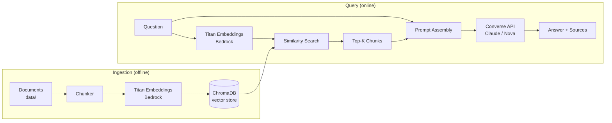

# Bedrock RAG QA Assistant


Retrieval-Augmented Generation (RAG) Q&A service built on **Amazon Bedrock** — Titan Embeddings for retrieval, generation via Bedrock's **Converse API** (provider-agnostic across Claude and Nova), ChromaDB for vector storage, with a serverless deployment path via Lambda + API Gateway (Terraform).

Ask a question, get an answer grounded in your own documents, with sources cited — running locally in minutes or deployed serverless on AWS.

---

## Live Demo

This is deployed and running on AWS right now — Lambda + API Gateway, fronting the same FastAPI app in this repo. Real request/response from the live instance:

```bash
$ curl -X POST <api-endpoint>/query -H "Content-Type: application/json" \
    -d '{"question": "What is the AWS Well-Architected Framework?"}'
```
```json
{
  "answer": "The AWS Well-Architected Framework is a set of guidelines published by AWS to help teams evaluate and improve the design of their cloud workloads. It is organized around six pillars: Operational Excellence, Security, Reliability, Cost Optimization, Sustainability, and Performance Efficiency.",
  "sources": [
    { "source_file": "aws-well-architected-summary.md", "score": 0.8603, "...": "..." }
  ],
  "latency_ms": 1283
}
```

The live URL isn't published here — it currently has no auth or rate limiting in front of it, so I'm not routing public/bot traffic at a paid AWS resource. Happy to share it directly on request, or spin up your own copy with `terraform apply` below.

## Why this exists

A hands-on reference implementation of a production-shaped RAG pipeline on AWS Bedrock — built to go deeper than a notebook demo: a real API, real IaC, real tests, and a real deployment path, including the unglamorous parts (Lambda package size limits, IAM for inference profiles, cross-platform dependency builds) documented in [docs/ARCHITECTURE.md](docs/ARCHITECTURE.md) rather than glossed over.

## Architecture



**Two deployment shapes, same code:**
- **Local / API** — FastAPI app (`src/api.py`), run with `uvicorn`
- **Serverless** — same FastAPI app wrapped for Lambda (`lambda/handler.py` via Mangum), fronted by API Gateway, provisioned with Terraform (`terraform/`), deployment package staged through S3

## Tech Stack

| Layer | Choice |
|---|---|
| Embeddings | Amazon Bedrock — Titan Embed Text v2 |
| Generation | Amazon Bedrock — Converse API (provider-agnostic: Claude or Nova, set via one env var) |
| Vector store | ChromaDB (local, persisted; seeded into Lambda's `/tmp` on cold start for the serverless deployment) |
| API | FastAPI + Uvicorn |
| Serverless runtime | AWS Lambda (via Mangum) + API Gateway (HTTP API) |
| IaC | Terraform (Lambda, API Gateway, IAM, S3 staging bucket) |
| Demo UI | Streamlit |
| Tests | pytest, mocked Bedrock calls (no AWS credentials needed to run CI) |

## What this demonstrates

- Amazon Bedrock (embeddings + generation), RAG pipeline design, prompt engineering
- Infrastructure-as-Code (Terraform) for a serverless AWS deployment, including IAM scoped to Bedrock inference-profile ARNs
- Real deployment troubleshooting: Lambda package-size limits, cross-platform (Windows → Linux) dependency builds via Docker, dependency-tree profiling and pruning
- API design (FastAPI), automated testing, CI (GitHub Actions)

## Project Structure

```
bedrock-rag-qa-assistant/
├── src/                  # Core RAG pipeline + API
│   ├── config.py
│   ├── ingest.py         # Chunk + embed + store documents
│   ├── retriever.py      # Embed query + similarity search
│   ├── generator.py      # Prompt assembly + generation
│   ├── bedrock_client.py # Bedrock Converse API + Titan embeddings
│   ├── rag_pipeline.py   # Orchestrates retriever + generator
│   └── api.py            # FastAPI app (/query, /health)
├── lambda/handler.py     # Lambda entrypoint (Mangum adapter, cold-start seeding)
├── terraform/            # Lambda + API Gateway + IAM + S3 staging (IaC)
├── scripts/               # Lambda build scripts (Docker-based, cross-platform)
├── streamlit_app.py      # Demo UI
├── data/sample_docs/     # Sample documents to ingest
├── tests/                # Unit tests (mocked Bedrock)
└── docs/                 # Architecture, quickstart, API reference
```

## Quickstart

See [docs/QUICKSTART.md](docs/QUICKSTART.md) for full setup. Short version:

```bash
python -m venv venv && source venv/bin/activate
pip install -r requirements.txt
cp .env.example .env          # fill in your AWS region / model IDs

python -m src.ingest          # embeds data/sample_docs into ChromaDB
uvicorn src.api:app --reload  # starts the API on :8000

curl -X POST localhost:8000/query -H "Content-Type: application/json" \
  -d '{"question": "What is the AWS Well-Architected Framework?"}'
```

## Deploying to AWS

```bash
# Windows: .\scripts\build_lambda_zip.ps1  (requires Docker Desktop running)
./scripts/build_lambda_zip.sh

cd terraform
terraform init
terraform apply -var="gen_model_id=<your-model-or-inference-profile-id>"
```

Provisions a Lambda function (deployed via S3, since the package exceeds Lambda's 50MB direct-upload limit), IAM scoped to the specific Bedrock inference-profile ARN in use, an API Gateway HTTP API, and CloudWatch logging. The build script installs dependencies inside a container matching Lambda's actual runtime and prunes ~200MB of unused transitive packages (chromadb pulls in a kubernetes client SDK and onnxruntime that this project never uses) to fit under Lambda's 250MB uncompressed limit. Full story in [docs/ARCHITECTURE.md](docs/ARCHITECTURE.md).

## Documentation

- [Architecture](docs/ARCHITECTURE.md) — ingestion/query flow, deployment shapes, design decisions, dependency-pruning rationale
- [Quickstart](docs/QUICKSTART.md) — full local setup walkthrough
- [API Reference](docs/API.md) — endpoint spec

## Roadmap

- [ ] Swap ChromaDB for OpenSearch Serverless for a fully-managed vector store option
- [ ] Add streaming responses (Bedrock `invoke_model_with_response_stream`)
- [ ] Add re-ranking step before generation
- [ ] Multi-format ingestion (PDF, DOCX) beyond .txt/.md
- [ ] API key / usage-plan on the API Gateway route, so the live demo can be linked publicly

## License

MIT — see [LICENSE](LICENSE)

